# Hydraulic Jack

This repo is a second-year diploma college project done by me and another classmate, Derick Tan Chia Han, as my assistance. This is a custom art selling e-commerce website built using [CodeIgniter PHP Framework](https://codeigniter.com/) with Jack Kang being the volunteered sponsor for this college project.

## Overview

### Project Requirements and Objectives

This project is a full stack project which dynamic data are stored in and supplied from the backend PhpMyAdmin database, mySQL is used to retrieve, add, modify data stored in database tables. Then data are to be display at the client side browser, allowing user to be interact with the web application. The application is divided into 2 sections, the user interface/view and admin interface/view.

User interface:

- allow customers to view the landing page
- sign up and login an account
- add product to cart
- filter product by date and by price
- purchase product through fake/ dummy payment gate
- update/ customize their profile image and background image
- view the "about artist" page which display information to the sponsor who helped and credit as the founder of the website branding

Admin interface:

- Allow admin to view all existing users profile & genral info in the site
- delete, add new products to the site
- Edit the info (name, price, status, description, stock amount)
- View payments receipt from users, data of the product sold (ratings, date added, amount sold and total revenue)

Project Highlight and challenges:

- The application developed should be mobile friendly, resizing the content accordingly to the device screen width
- Cross Browser support for CSS design (Not yet fully implemented, some browser may still not provide support for the CSS implemented in this project)

### Screenshots

- User Interface (Customer views/site)

  - Home Page
    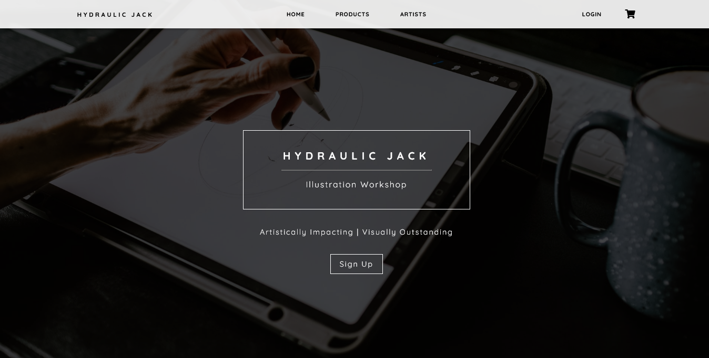

  - Login Page
    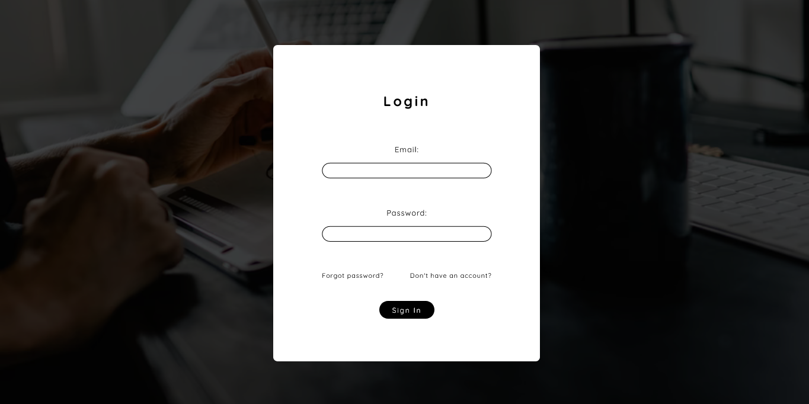

  - User Profile Page
    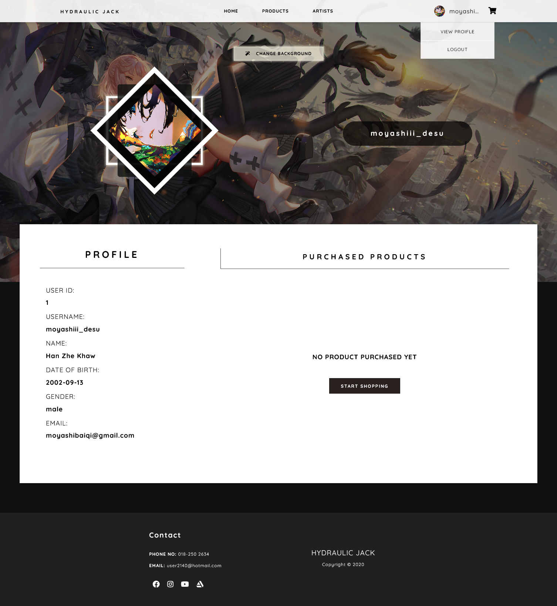

  - Product Spec Page
    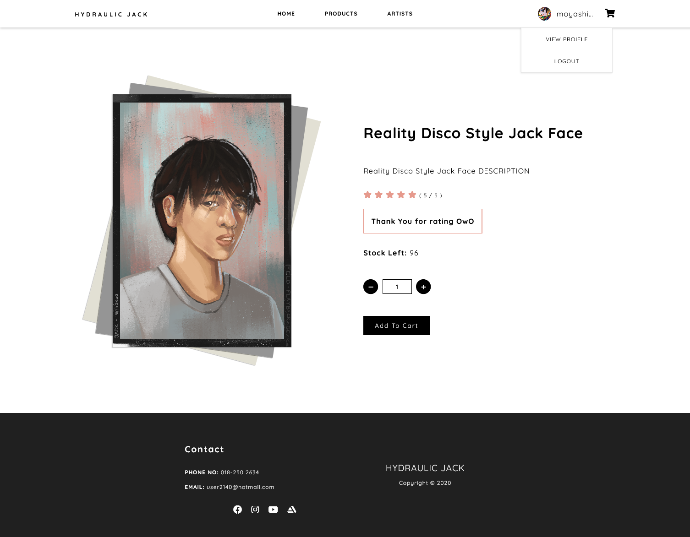

  - Payment Receipt Page
    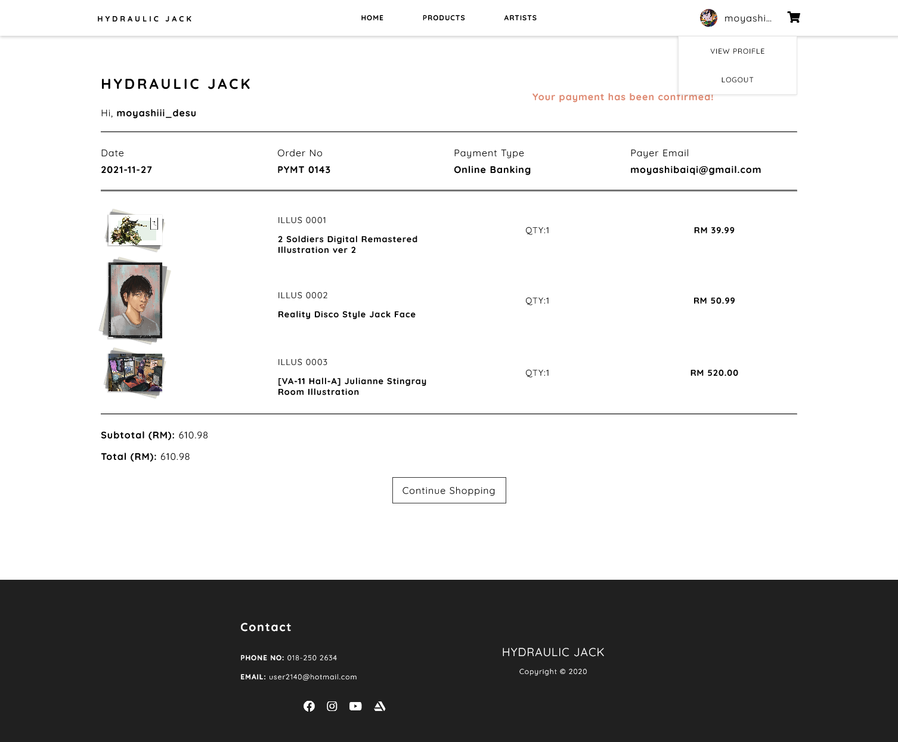
	
  - About Artist Page
    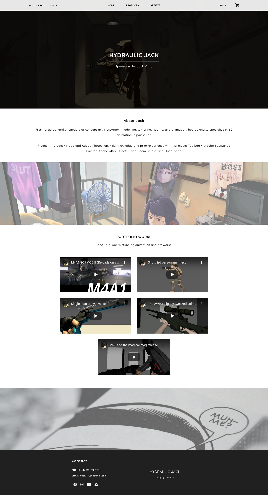

- Admin Interface (Admin views/site.png)

  - Admin Dashboard
    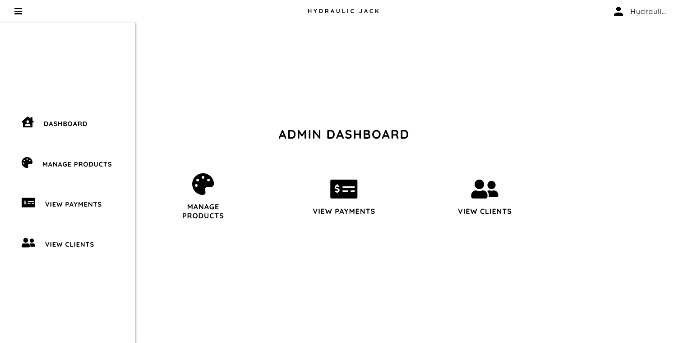

  - Product Management
    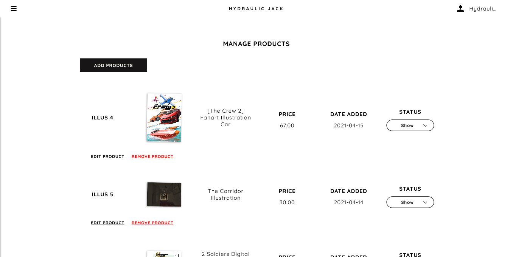
    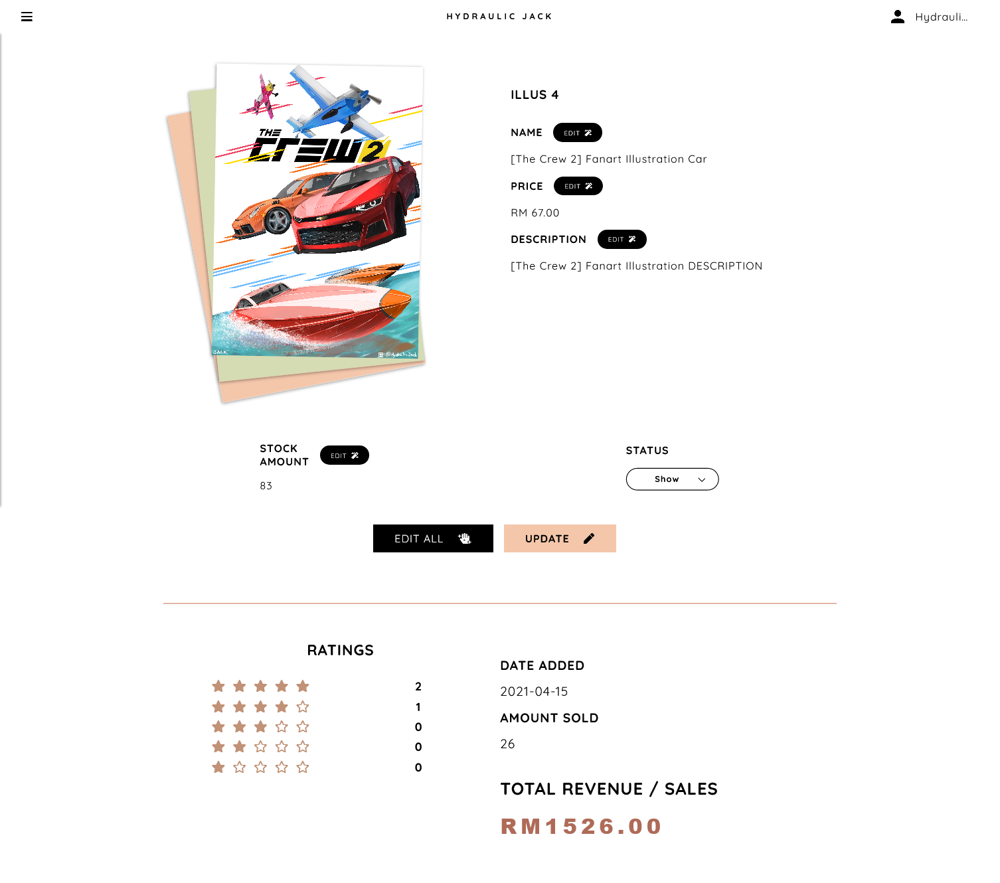

  - View All Customers' Payment History
    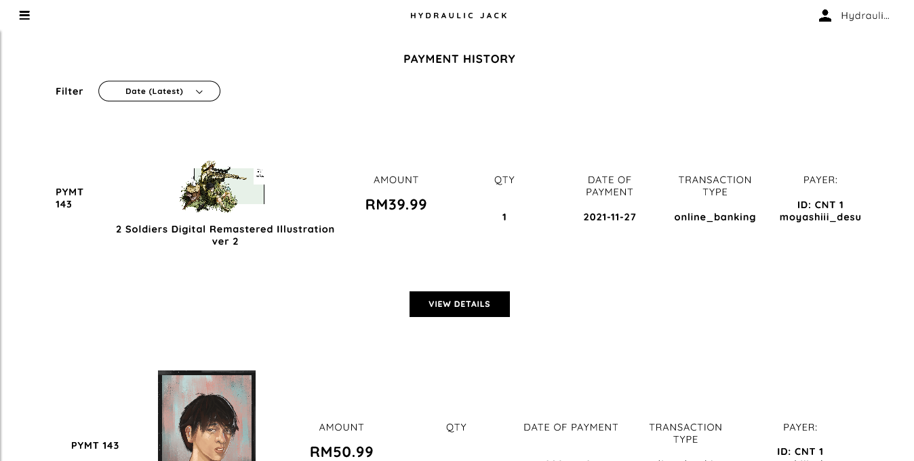

  - View All Customers' General Profile Info
    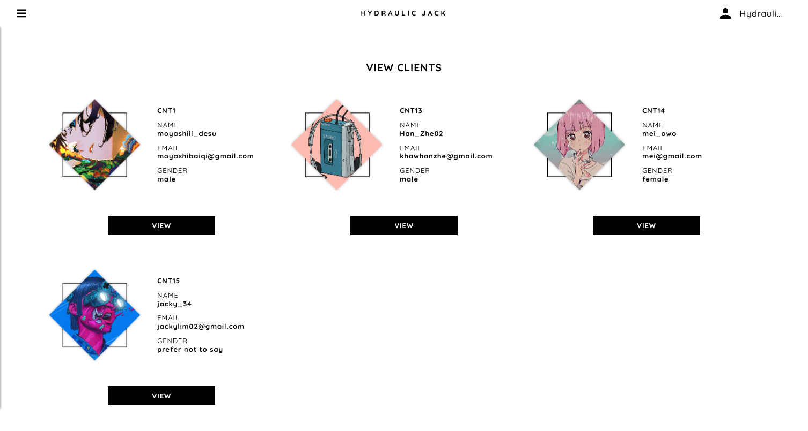

# What is CodeIgniter Framework used in our project?

CodeIgniter is an Application Development Framework - a toolkit - for people who build web sites using PHP. Its goal is to enable you to develop projects much faster than you could if you were writing code from scratch, by providing a rich set of libraries for commonly needed tasks, as well as a simple interface and logical structure to access these libraries. CodeIgniter lets you creatively focus on your project by minimizing the amount of code needed for a given task.

## Release Information

This repo contains in-development code for future releases. To download the latest stable release please visit the [CodeIgniter Downloads](https://codeigniter.com/download) page.

## Changelog and New Features

You can find a list of all changes for each release in the [user guide change log](https://github.com/bcit-ci/CodeIgniter/blob/develop/user_guide_src/source/changelog.rst).

## Server Requirements

PHP version 5.6 or newer is recommended.

It should work on 5.3.7 as well, but we strongly advise you NOT to run such old versions of PHP, because of potential security and performance issues, as well as missing features.

## Installation

Please see the [installation section](https://codeigniter.com/user_guide/installation/index.html) of the CodeIgniter User Guide.

## License

Please see the [license agreement](https://github.com/bcit-ci/CodeIgniter/blob/develop/user_guide_src/source/license.rst).

## More Resources About CodeIgniter Framework

User Guide

- [Language File Translations](https://codeigniter.com/docs)
- [Community Forums](https://github.com/bcit-ci/codeigniter3-translations)
- [Community Wiki](https://forum.codeigniter.com/)
- [Community Slack Channel](https://github.com/bcit-ci/CodeIgniter/wiki)

Report security issues to our [Security Panel](security@codeigniter.com) or via our [page on HackerOne](https://hackerone.com/codeigniter?type=team), thank you.
